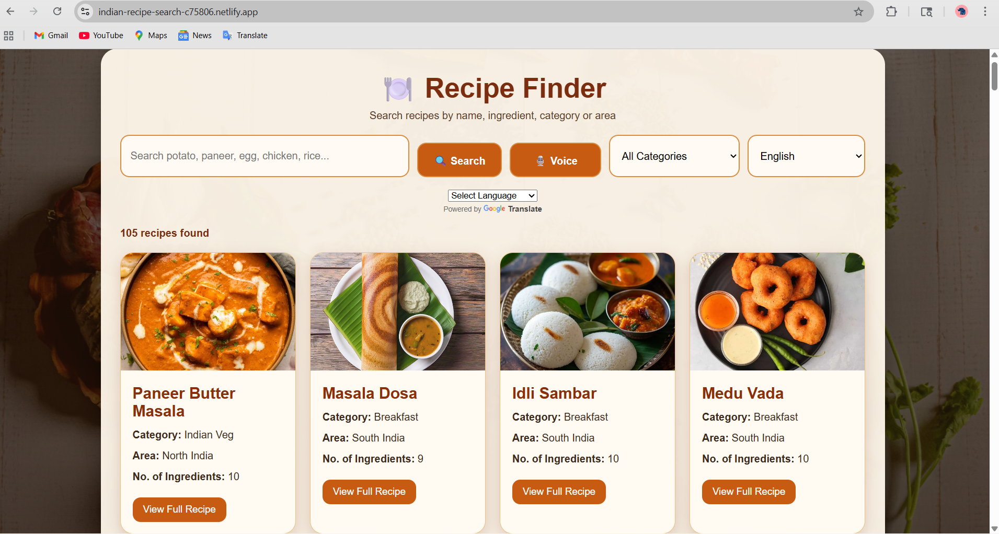

# Indian Recipe Search 🍽️

A responsive recipe finder web app where users can search recipes by dish name, ingredient, category, or area.

## Live Demo
https://indian-recipe-search-c75806.netlify.app

## Features
- Search by recipe name
- Search by ingredients (potato, paneer, egg, rice, chicken)
- Category filter
- Voice search
- Recipe images
- Ingredient count
- Step-by-step instructions
- YouTube recipe video links
- Beef and pork filtered

## Tech Stack
- HTML
- CSS
- JavaScript
- Netlify

## Author
Nithya 

## 📌 Status
This project is completed and deployed successfully.

## 📸 Screenshot

## ✨ Key Highlights
- Clean and responsive UI
- Beginner-friendly JavaScript project
- Deployed using Netlify

## 🙋‍♀️ Author
 Nithya

